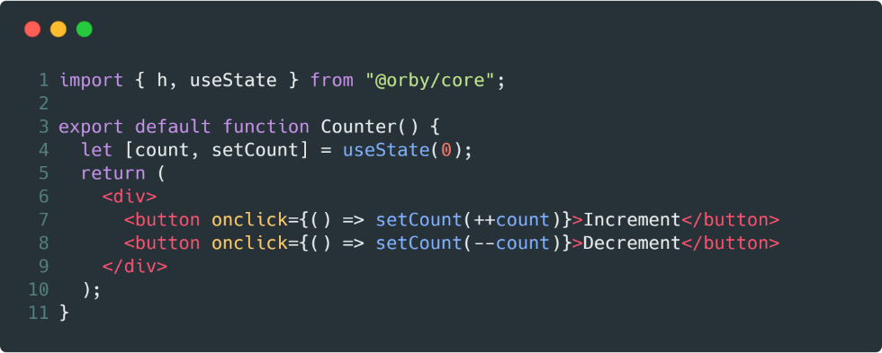

 

# @orby/core

**Orby** is a small experiment of functional components based on JSX and virtual-dom.

[](https://codesandbox.io/s/lpk8wy0njz)

> **Orby**, is responsible for maintaining a unique state for each functional component.

## Arguments of the component

A component based on **Orby**, can read 3 arguments.

1. **props** : Properties associated with the component.
2. **state** : Controlador del estado del componente.
3. **context** : Context given to the component from a higher level.

```js
function Component(props,state,context){
  return <div>
      {props.children}
  </div>
}
```

### Props

Property object associated with the component definition:

```js
<Component id="10">
   <h1>sample</h1> 
</Component>

```
> the properties of the component will be `{id:"10", children:[...]}`

### State

The state of each component is read by using `state.get()` and is updated by using `state.set()`.

```js
function Component(props,state,context){
  return <button click={()=>state.set("Orby")}>
      Hi {state.get()||""}
  </button>
}
```

You can use `{set, get}` to directly access `state.set` and `state.get`.

**Orby**, allows an initial state definition externally, through the property `state=<any>`, associated to the component.

```js
function App(props , {get}){
   get()// [1,2,3,4,5]
   return <button>Orby</button>;
}

<App state={[1,2,3,4,5]}/>
```

### Context

You can share states by using the `context=<object>` property, associated with the component.

```js
render(
  <App context={{parent:[1,2,3]}}/>,
  document.querySelector("#app")
)
```

You can define an initial context simply as property.

```js
function App(){
  return <OtherComponent context={{parent:[1,2,3]}}/>
}
```

You can modify the context simply by defining it as a property.

### Children

A diferencia de **React**, **Orby** obliga a cada niño asociado con el componente a ser un nodo virtual.

As an author I do not find coherent the use of `props.children[0]`, to access a function associated with the child.

```js
<App>
{()=>{
  /** It doesn't work **/
}}
</App>
```

Recommends associating it with a property because, in the opinion of the author, I find it more readable, and adapts to the best definition and type checking.

```js
<App fun={()=>{

}}/>
```

## Lifecycle

**Orby** has a life cycle inspired by [Hyperapp](https://github.com/jorgebucaran/hyperapp).

### create

It is executed once the tag is created.

```js
<h1 create={(target:HTMLElement)=>{
  /** any **/
}}>
  Orby
</h1>
```

### created

It is executed once the node tree associated with the tag has been created.

```js
<h1 created={(target:HTMLElement)=>{
  target.querySelector("button");
}}>
  <button>Orby</button>  
</h1>
```

### remove

It runs once the label has been removed from the main node.

```js
<h1 remove={(target:HTMLElement)=>{
  /** any **/
}}>
  Orby
</h1>
```
### removed

It is executed once the remove event has been issued to all the children of the node.

```js
<h1 removed={(target:HTMLElement)=>{
  /** any **/
}}>
  Orby
</h1>
```

### update

It runs once the view associated with the tag is rendered, if update returns `false`, it will not propagate the change to its children.

```js
<h1 update={(props:Object, target:HTMLElement)=>{
  /** any **/
}}>
   Orby
</h1>
```
### updated

Run once the view has been rendered

```js
<h1 update={( target:HTMLElement)=>{
  target.querySelector("button");
}}>
  <button>Orby</button>  
</h1>
```

## Examples

### [counter](https://codesandbox.io/s/lpk8wy0njz)

Example that teaches how to work with the state of a component.

## Accessories

## @orby/tag

It allows to encapsulate the entire render effect within a **custom-element**.

```js
import {h} from "@orby/core";
import define from "@orby/tag";
import Counter from "./components/counter";

define(
    <my-counter
        props={["state"]}
        render={Counter}
    />
);
```

Finally you can use `<my-counter/>` without problems inside your **html**

```html
<my-counter state="0"></my-counter>
<my-counter state="10"></my-counter>
<my-counter state="20"></my-counter>
```

## Soon...

### @orby/router 
### @orby/store
### @orby/style

